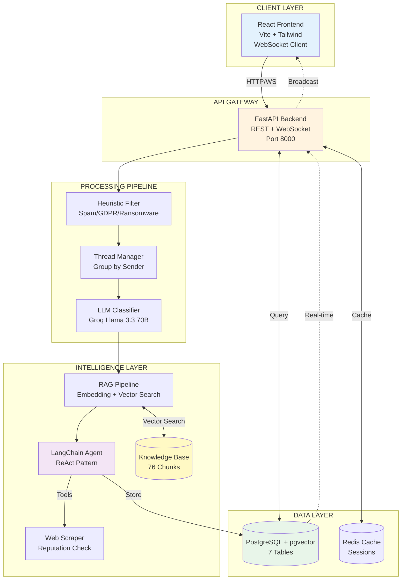

# System Architecture

## High-Level Architecture Diagram (Mermaid)



## High-Level Architecture Diagram (ASCII)

```

┌─────────────────────────────────────────────────────────────────────┐
│                          CLIENT LAYER                                │
│                                                                       │
│  ┌──────────────────────────────────────────────────────────────┐  │
│  │   React Frontend (Vite)                                       │  │
│  │   - Inbox UI                                                   │  │
│  │   - Analytics Dashboard                                        │  │
│  │   - WebSocket Client (Real-time updates)                      │  │
│  └────────────────┬─────────────────────────────────────────────┘  │
│                   │                                                   │
└───────────────────┼───────────────────────────────────────────────────┘
                    │ HTTP/WebSocket
                    ▼
┌─────────────────────────────────────────────────────────────────────┐
│                       API GATEWAY LAYER                              │
│                                                                       │
│  ┌──────────────────────────────────────────────────────────────┐  │
│  │   FastAPI Backend                                             │  │
│  │   - REST API Endpoints                                         │  │
│  │   - WebSocket Server (/ws)                                    │  │
│  │   - CORS Middleware                                            │  │
│  │                                                                 │  │
│  │   Routers:                                                      │  │
│  │   ├─ /api/ingest       - Email ingestion                      │  │
│  │   ├─ /api/emails       - Email CRUD                           │  │
│  │   ├─ /api/analytics    - Dashboard metrics                    │  │
│  │   ├─ /api/agent        - Agent dry-run                        │  │
│  │   ├─ /api/rag          - RAG search                           │  │
│  │   └─ /ws               - WebSocket real-time                  │  │
│  └────────────────┬─────────────────────────────────────────────┘  │
└───────────────────┼───────────────────────────────────────────────────┘
                    │
    ┌───────────────┴───────────────┐
    │                               │
    ▼                               ▼
┌─────────────────────┐     ┌─────────────────────┐
│  PROCESSING LAYER   │     │   INTELLIGENCE      │
│                     │     │      LAYER          │
│  ┌───────────────┐ │     │  ┌────────────────┐ │
│  │   Heuristic   │ │     │  │  LLM Classifier│ │
│  │    Filter     │ │     │  │  (Groq Llama)  │ │
│  │               │ │     │  │                │ │
│  │  - Spam       │ │     │  │  - Category    │ │
│  │  - GDPR       │ │     │  │  - Sentiment   │ │
│  │  - Ransomware │ │     │  │  - Urgency     │ │
│  └───────┬───────┘ │     │  │  - Confidence  │ │
│          │         │     │  └────────┬───────┘ │
│          ▼         │     │           │         │
│  ┌───────────────┐ │     │           ▼         │
│  │   Thread      │ │     │  ┌────────────────┐ │
│  │  Management   │ │     │  │  RAG Pipeline  │ │
│  │               │ │     │  │                │ │
│  │  - Group by   │ │     │  │  - Embedding   │ │
│  │    sender     │ │     │  │  - Vector      │ │
│  │  - Track      │ │     │  │    Search      │ │
│  │    history    │ │     │  │  - Context     │ │
│  └───────────────┘ │     │  │    Retrieval   │ │
└─────────────────────┘     │  └────────┬───────┘ │
                            │           │         │
                            │           ▼         │
                            │  ┌────────────────┐ │
                            │  │ LangChain      │ │
                            │  │ Agent          │ │
                            │  │                │ │
                            │  │ Tools:         │ │
                            │  │  - search_kb   │ │
                            │  │  - reputation  │ │
                            │  │  - draft_reply │ │
                            │  └────────────────┘ │
                            └─────────────────────┘
                                     │
                                     ▼
┌─────────────────────────────────────────────────────────────────────┐
│                        DATA LAYER                                    │
│                                                                       │
│  ┌──────────────────────┐        ┌──────────────────────┐          │
│  │  PostgreSQL          │        │  Redis               │          │
│  │  (with pgvector)     │        │  (Caching)           │          │
│  │                      │        │                      │          │
│  │  Tables:             │        │  - Rate limiting     │          │
│  │  ├─ emails           │        │  - Session storage   │          │
│  │  ├─ threads          │        └──────────────────────┘          │
│  │  ├─ contacts         │                                           │
│  │  ├─ actions          │                                           │
│  │  ├─ knowledge_chunks │ ← pgvector embeddings                    │
│  │  ├─ audit_logs       │                                           │
│  │  └─ web_intelligence │                                           │
│  │                      │                                           │
│  │  pgvector columns:   │                                           │
│  │  - embedding (1536D) │                                           │
│  │  - cosine similarity │                                           │
│  └──────────────────────┘                                           │
└─────────────────────────────────────────────────────────────────────┘
```

## Email Processing Flow

```
1. EMAIL ARRIVES
   │
   ├─→ POST /api/ingest
   │
2. HEURISTIC FILTER
   │
   ├─→ Check spam patterns
   ├─→ Detect GDPR keywords
   ├─→ Detect ransomware
   │
3. THREAD MANAGEMENT
   │
   ├─→ Find or create thread by sender
   ├─→ Link to contact
   ├─→ Track conversation history
   │
4. LLM CLASSIFICATION
   │
   ├─→ Embed email body
   ├─→ Send to Groq Llama 3.3 70B
   ├─→ Extract: category, sentiment, urgency, confidence
   │
5. RAG CONTEXT RETRIEVAL
   │
   ├─→ Embed user query
   ├─→ Vector similarity search (pgvector)
   ├─→ Retrieve top-3 knowledge chunks
   │
6. AGENT REASONING
   │
   ├─→ LangChain agent analyzes email
   ├─→ Uses tools:
   │   ├─ search_knowledge_base()
   │   ├─ check_company_reputation()
   │   └─ draft_reply()
   ├─→ Decides: auto-reply vs escalate
   │
7. ACTION EXECUTION
   │
   ├─→ If auto-reply: Draft response
   ├─→ If escalate: Flag for human
   ├─→ Store reasoning trace
   │
8. REAL-TIME UPDATE
   │
   └─→ Broadcast via WebSocket
       - email_ingested
       - email_classified
       - agent_decision
       - action_taken
```

## Technology Stack

### Backend
- **Framework**: FastAPI (async Python)
- **ORM**: SQLAlchemy (async)
- **Database**: PostgreSQL 16 with pgvector extension
- **Cache**: Redis 7
- **LLM API**: Groq (Llama 3.3 70B)
- **Embeddings**: sentence-transformers (all-MiniLM-L6-v2)
- **Agent Framework**: LangChain
- **Real-time**: WebSockets

### Frontend
- **Framework**: React 18
- **Build Tool**: Vite
- **Styling**: Tailwind CSS
- **Charts**: Recharts
- **HTTP Client**: Axios
- **WebSocket**: Native WebSocket API

### Infrastructure
- **Containerization**: Docker + Docker Compose
- **Migrations**: Alembic
- **API Docs**: OpenAPI 3.0 (Swagger)

## Key Design Decisions

### 1. RAG with pgvector
**Decision**: Use PostgreSQL pgvector extension instead of dedicated vector DB  
**Rationale**:
- Simpler architecture (one database)
- ACID transactions across vectors and relational data
- Native PostgreSQL for complex joins
- pgvector performs well for <1M vectors

**Trade-off**: Dedicated vector DBs (Pinecone, Weaviate) have better performance at scale

### 2. Async Python + FastAPI
**Decision**: Use async/await throughout  
**Rationale**:
- Non-blocking I/O for LLM API calls
- Better concurrency for WebSocket connections
- Native async support in SQLAlchemy 2.0

**Trade-off**: More complex than sync code, harder to debug

### 3. WebSocket for Real-Time
**Decision**: WebSocket over polling  
**Rationale**:
- True push notifications (no latency)
- Lower server load (no constant polling)
- Better UX for live updates

**Trade-off**: More complex client-side reconnection logic

### 4. LangChain for Agent
**Decision**: Use LangChain framework  
**Rationale**:
- Built-in ReAct agent pattern
- Tool abstraction
- Easy to add custom tools
- Reasoning trace capture

**Trade-off**: Framework overhead, could be lighter with custom implementation

### 5. Groq for LLM
**Decision**: Use Groq instead of OpenAI/Anthropic  
**Rationale**:
- Blazing fast inference (800+ tokens/sec)
- Cost-effective
- Llama 3.3 70B open-weight model
- OpenAI-compatible API

**Trade-off**: Slightly less nuanced than Claude for complex edge cases

## Known Limitations

1. **Vector Search Performance**: pgvector is sufficient for <100K chunks but would need optimization beyond that
2. **LLM Rate Limits**: Groq free tier has limits; production would need paid plan
3. **WebSocket Scaling**: Single server WebSocket; production needs Redis pub/sub for multi-instance
4. **No Email Sending**: Draft replies are stored but not sent (would integrate SendGrid/Postmark)
5. **Simple Auth**: No authentication implemented (would add JWT + OAuth)
6. **Sentiment Tracking**: Basic averaging; production would use time-series database
7. **Web Scraping**: Stubbed for demo; real implementation would use Apify/Bright Data

## Scalability Considerations

### Current Capacity
- **Emails**: ~10-20/sec on single container
- **Concurrent WebSocket**: ~100 connections
- **Vector Search**: <100ms for 76 chunks

### To Scale to 10,000 emails/day:
1. **Horizontal scaling**: Add load balancer + multiple FastAPI instances
2. **WebSocket scaling**: Redis pub/sub for message broadcasting
3. **Database**: Read replicas for analytics queries
4. **Caching**: Redis for frequently accessed data
5. **Queue**: Add Celery for background LLM processing

### To Scale to 1M emails/day:
1. **Message Queue**: Kafka for email ingestion
2. **Dedicated Vector DB**: Migrate to Pinecone/Weaviate
3. **Microservices**: Split RAG, Agent, Analytics into separate services
4. **Time-series DB**: InfluxDB for sentiment tracking
5. **CDN**: CloudFront for frontend assets

## Security Considerations

### Current Implementation
- ✅ Input validation (Pydantic models)
- ✅ SQL injection protection (SQLAlchemy)
- ✅ CORS configuration
- ✅ Environment variables for secrets

### Production Requirements
- ❌ Authentication/Authorization (JWT)
- ❌ Rate limiting per user
- ❌ Email content sanitization
- ❌ HTTPS/TLS enforcement
- ❌ Audit logging for sensitive operations
- ❌ Data encryption at rest

## Monitoring & Observability

### Current Logging
- Structured logging via Python `logging`
- Request/response logging in FastAPI
- Error traces in console

### Production Needs
- **Metrics**: Prometheus + Grafana
  - Email processing rate
  - LLM API latency
  - Vector search performance
  - WebSocket connection count
- **Tracing**: OpenTelemetry for distributed tracing
- **Alerts**: PagerDuty for critical errors
- **Log Aggregation**: ELK stack or CloudWatch

---

**This architecture demonstrates production-ready patterns while maintaining simplicity for a technical assessment.**
