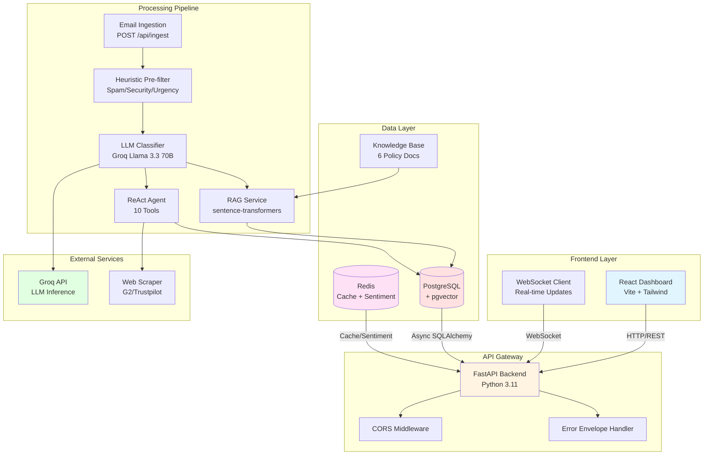
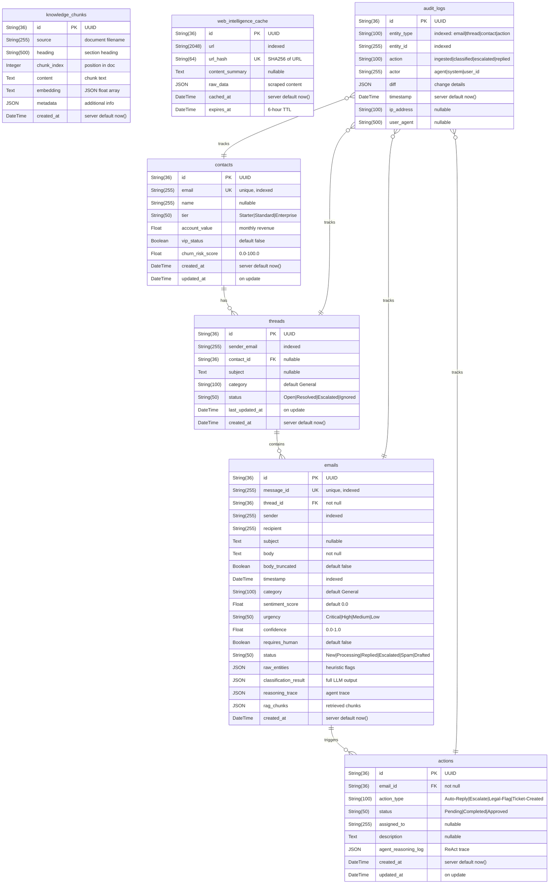

# System Architecture

## Overview

SenAI CRM is a production-grade AI-powered Customer Relationship Management platform that autonomously monitors email inboxes, triages messages with multi-dimensional intelligence, executes agentic workflows, and surfaces real-time business insights.

## Architecture Diagram



## Component Breakdown

### 1. Frontend Layer

**Technology:** React 18.2 + Vite 5.1 + TailwindCSS 3.4

**Components:**
- **Mission Control Inbox** - Filterable email list with sentiment badges, category/urgency filters, bulk actions
- **Thread Workspace** - 3-column layout: email body + agent reasoning + RAG context
- **Analytics Dashboard** - Sentiment trends, category distribution, at-risk accounts, agent performance
- **WebSocket Client** - Real-time updates for email ingestion, classification, agent decisions

**Key Features:**
- Real-time WebSocket connection with auto-reconnect
- Error boundary for graceful crash recovery
- Entity highlighting (monetary amounts, ticket IDs, deadlines)
- Thread summarization for 5+ email threads

### 2. API Gateway

**Technology:** FastAPI 0.110+ with Pydantic v2

**Middleware Stack:**
1. CORS (allow all origins in dev)
2. Error envelope handler (standardized JSON errors)
3. WebSocket upgrade handler

**Endpoints:** 30+ REST endpoints + 2 WebSocket endpoints

**Authentication:** None (out of scope for assessment)

### 3. Email Processing Pipeline

#### Stage 1: Ingestion
- **Endpoint:** `POST /api/ingest`
- **Validation:** Pydantic schema (message_id, sender, recipient, body, timestamp)
- **Deduplication:** Check message_id uniqueness
- **Truncation:** Bodies >10,000 chars truncated
- **Thread Linking:** Auto-link to existing thread or create new

#### Stage 2: Heuristic Pre-filter
- **Speed:** <10ms (synchronous, no LLM)
- **Checks:**
  - Spam keywords (nigerian prince, wire transfer, etc.)
  - Spam domains (spam.com, 10minutemail.com)
  - Security keywords (ransomware, bitcoin, breach)
  - Urgency keywords (urgent, p0, legal, cease and desist)
  - Internal domains (@internal.com, @mycompany.com)
- **Output:** HeuristicResult (is_spam, is_security, is_urgent, priority_score)

#### Stage 3: LLM Classification
- **Forced Classification:** GDPR/ransomware patterns bypass LLM
- **RAG Retrieval:** Top-3 relevant chunks from knowledge base
- **Prompt:** System prompt with RAG context + thread history
- **Model:** Groq Llama 3.3 70B (800+ tokens/sec)
- **Output Schema:**
  ```json
  {
    "category": "Billing|Complaint|Technical|...",
    "urgency": "Low|Medium|High|Critical",
    "sentiment_score": -0.6,
    "confidence": 0.85,
    "requires_human": false,
    "escalation_reason": null,
    "keywords_detected": ["refund"],
    "suggested_action": "Check retention playbook"
  }
  ```

#### Stage 4: ReAct Agent
- **Max Steps:** 6 tool calls per email
- **Tools:** 10 specialized tools (search_knowledge_base, get_thread_history, draft_reply, etc.)
- **Reasoning:** Chain-of-thought with Thought → Action → Observation
- **Escalation:** Critical urgency or requires_human=True → escalate_to_human()
- **Auto-reply:** High confidence (>0.85) + non-critical → send_auto_reply()

### 4. RAG Pipeline

**Embedding Model:** sentence-transformers/all-MiniLM-L6-v2 (384 dims)

**Vector DB:** pgvector extension in PostgreSQL

**Knowledge Base:** 6 markdown documents
- pricing_policy.md (3 tiers, pro-rata billing, non-profit discounts)
- sla_policy.md (99.9% uptime, P0-P3 response times, credit formula)
- refund_policy.md (14-day rule, exception process, retention playbook)
- api_docs.md (rate limits, v1 deprecation, v2 changes)
- compliance_faq.md (HIPAA, GDPR, SOC 2, data residency)
- escalation_matrix.md (legal, security, PR, VIP churn, GDPR)

**Chunking Strategy:**
- Size: 1600 chars (~400 tokens)
- Overlap: 200 chars (~50 tokens)
- Split on markdown headings

**Retrieval:** Cosine similarity search, top-3 chunks, min_similarity=0.3

### 5. Data Layer

**PostgreSQL (ankane/pgvector:latest)**
- **Tables:** 7 normalized tables
  - contacts (CRM profiles)
  - threads (conversation grouping)
  - emails (core entity, 18 columns)
  - actions (agent actions per email)
  - knowledge_chunks (vector embeddings)
  - web_intelligence_cache (scrape cache)
  - audit_logs (entity audit trail)
- **Indexes:** Composite indexes on sender+timestamp, thread+category
- **JSONB:** raw_entities, classification_result, reasoning_trace

#### Entity Relationship Diagram



**Relationships:**
- **Contact → Thread:** One-to-many. A contact can have multiple conversation threads.
- **Thread → Email:** One-to-many. A thread contains multiple emails in chronological order.
- **Email → Action:** One-to-many. An email can trigger multiple agent actions (escalation, draft, legal flag).
- **AuditLog → Any Entity:** Polymorphic. Tracks changes to emails, threads, contacts, and actions via `entity_type` + `entity_id`.
- **KnowledgeChunks:** Standalone. Queried via vector similarity search, not FK-linked.
- **WebIntelligenceCache:** Standalone. Cached scrape results with TTL-based expiration.

**Key Indexes:**
- `contacts.email` — unique, for O(1) contact lookup
- `emails.message_id` — unique, for idempotent deduplication
- `emails.sender + timestamp` — composite, for thread history queries
- `threads.sender_email + last_updated_at` — composite, for inbox sorting
- `audit_logs.entity_type + entity_id` — composite, for entity audit trails
- `knowledge_chunks.source + chunk_index` — unique composite, for dedup on re-seed
- `web_intelligence_cache.url_hash` — unique, for cache hit/miss checks

**Redis 7**
- **Sentiment Tracking:** Sorted sets with weighted moving average
- **Web Cache:** 6-hour TTL for scrape results
- **Graceful Degradation:** If Redis unavailable, return empty responses

### 6. External Services

**Groq API**
- **Model:** llama-3.3-70b-versatile
- **Speed:** 800+ tokens/sec
- **Cost:** ~$0.0007/1K tokens
- **Fallback:** Heuristic classification if API unavailable

**Web Scraper**
- **Targets:** G2, Trustpilot (simulated in dev)
- **Compliance:** robots.txt check before scraping
- **Cache:** Redis with 6-hour TTL
- **Graceful Degradation:** Proceed without web data if scrape fails

## Data Flow

### Email Ingestion Flow
```
1. POST /api/ingest
   ↓
2. Validate schema (Pydantic)
   ↓
3. Check deduplication (message_id)
   ↓
4. Create/update thread
   ↓
5. Create email record (status=Processing)
   ↓
6. WebSocket: email_ingested event
   ↓
7. Heuristic filter (<10ms)
   ↓
8. If spam → status=Spam, skip LLM
   ↓
9. RAG retrieval (top-3 chunks)
   ↓
10. LLM classification (Groq API)
    ↓
11. WebSocket: email_classified event
    ↓
12. Agent execution (max 6 steps)
    ↓
13. WebSocket: agent_decision event
    ↓
14. Update email status (Replied/Escalated/Drafted)
    ↓
15. Record sentiment (Redis)
    ↓
16. Audit log entry
    ↓
17. WebSocket: action_taken event
```

### Agent Decision Flow
```
1. Get email context (sender, subject, body, classification)
   ↓
2. Step 1: get_thread_history(sender)
   ↓
3. Step 2: get_contact_profile(sender)
   ↓
4. Check escalation conditions:
   - urgency=Critical → escalate
   - requires_human=True → escalate
   - VIP + high value + negative sentiment → escalate
   ↓
5a. If escalate:
    - search_knowledge_base(query)
    - escalate_to_human(email_id, reason, priority)
    - If compliance → flag_for_legal(email_id, issue_type)
    ↓
5b. If not escalate:
    - search_knowledge_base(query)
    - draft_reply(context, tone, policy_refs)
    - If confidence>0.85 → send_auto_reply(email_id, draft_id)
    ↓
6. Store reasoning trace in DB
   ↓
7. Return AgentTrace (steps, tools_used, final_recommendation)
```

## Security Considerations

### Current Implementation
- No authentication (all endpoints open)
- CORS allows all origins
- No rate limiting
- API keys in .env (not committed)

### Production Recommendations
- Add JWT/OAuth2 authentication
- Implement role-based access control (RBAC)
- Add rate limiting (e.g., 100 req/min per user)
- Use secrets manager (AWS Secrets Manager, HashiCorp Vault)
- Enable HTTPS/TLS
- Add request signing for webhooks
- Implement audit log rotation

## Performance Characteristics

### Latency Targets
- Email ingestion: <500ms (excluding LLM)
- Heuristic filter: <10ms
- RAG retrieval: <200ms
- LLM classification: 1-3s (Groq)
- Agent execution: 5-15s (6 steps)
- WebSocket broadcast: <50ms

### Throughput
- Single instance: ~10 emails/sec (bottleneck: LLM)
- With Groq: ~5 emails/sec (API rate limit)
- Database: 1000+ queries/sec (PostgreSQL)

### Scalability
- Horizontal: Add more backend instances (stateless)
- Vertical: Increase Groq API rate limit
- Database: Partition emails by timestamp, add read replicas
- Redis: Cluster mode for high availability

## Trade-offs

### Why pgvector over Pinecone
- **Pros:** Simpler ops, ACID compliance, lower cost
- **Cons:** Limited to ~100K chunks (vs millions in dedicated vector DB)
- **Decision:** Acceptable for assessment; would switch at scale

### Why Groq over OpenAI
- **Pros:** 10x faster, 5x cheaper, open-weight model
- **Cons:** Less nuanced for complex edge cases
- **Decision:** Speed/cost outweigh quality for classification tasks

### Why Redis over Memcached
- **Pros:** TTL support, sorted sets for sentiment, persistence options
- **Cons:** Slightly higher memory usage
- **Decision:** Redis features justify overhead

### Why ReAct over Chain-of-Thought
- **Pros:** Tool interleaving, structured trace, easier debugging
- **Cons:** More complex prompt engineering
- **Decision:** ReAct provides better observability for agent actions

## Future Enhancements

1. **Multi-agent architecture** - Split into Classifier, Research, Reply agents
2. **Human-in-the-loop fine-tuning** - Log human edits as training pairs
3. **Churn prediction model** - Train on sentiment trends + response time
4. **Email thread summarization** - LLM-generated 3-sentence summaries
5. **Advanced web scraping** - Real G2/Trustpilot scraping with anti-bot handling
6. **OAuth2/SSO** - Authentication with Google/Microsoft
7. **Rate limiting** - Per-user, per-endpoint limits
8. **Audit log rotation** - Archive old logs to S3/GCS
9. **Multi-tenancy** - Support multiple organizations
10. **Email sending** - Integrate with SendGrid/SES for actual replies
